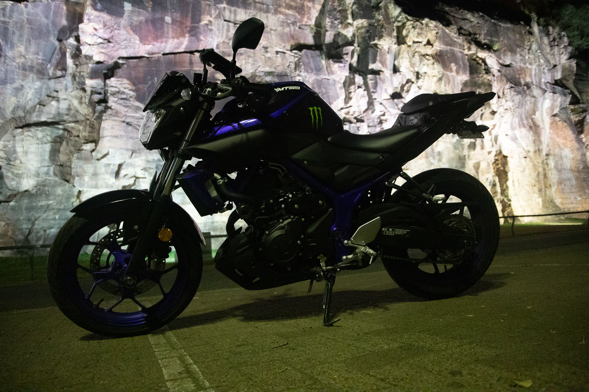
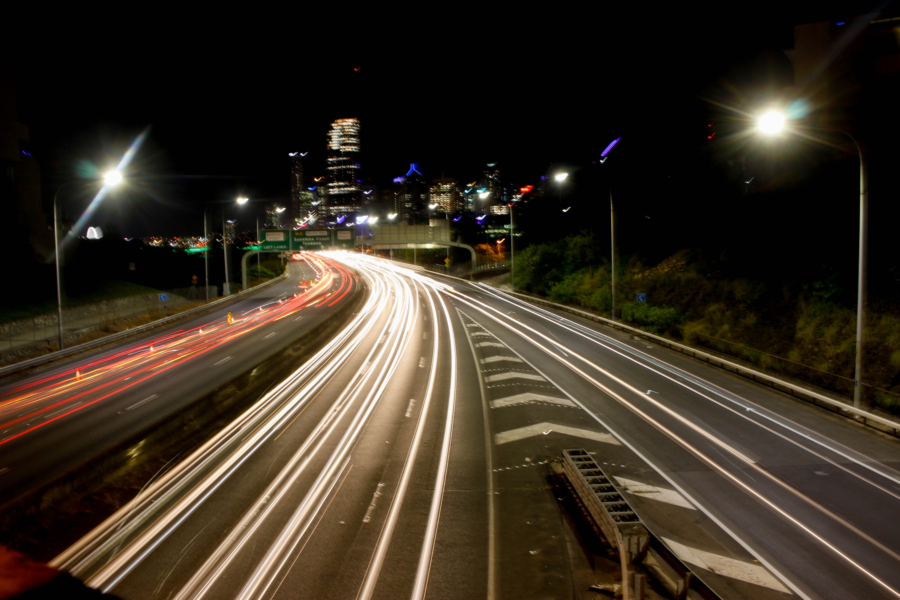
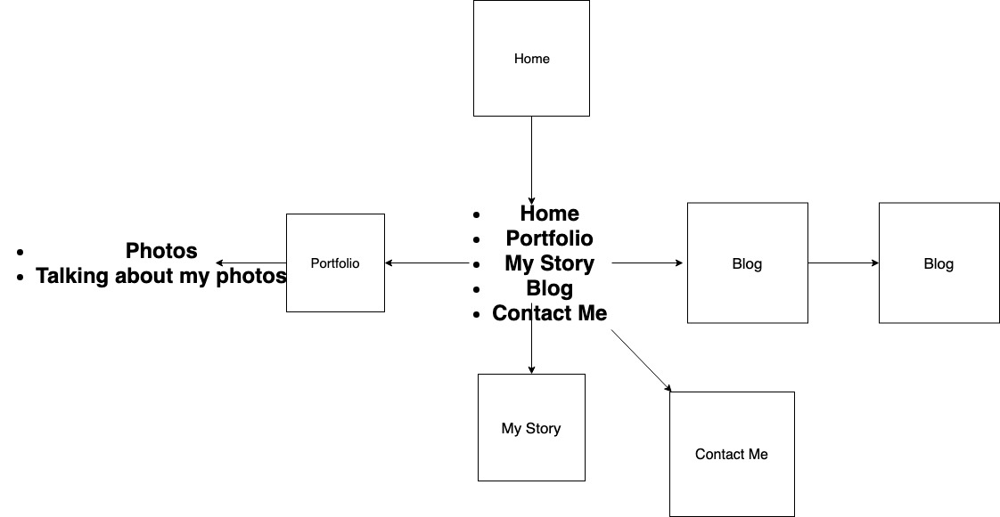

Portfoilio Assessment 2019

https://github.com/nickf94/Portfolio2019 <---- Git Hub Repo

https://nickf94.github.io/Portfolio2019/Home.html <---- Github Pages URL

All Photos were taken by me (Nick Fletcher) background photo was used from Pexels.com

How I came up with my idea to design my portfolio like I have came down to just wanting something that was different but unique, something that would stand out from anyone else. Since I love to take photos i decided that my target audience for this website portfolio would be people who like photography just as i do.

**Design Process**

When i first started thinking about what i wanted to do for my portfolio I had already built a simple webpage template from listening to tutorials about html and css, so when it came to learning that we had to do a portfolio for our next assessment i just had to take what i already had and then add more things as we learnt more about html and css.

I changed my mind about what i wanted it to look like a few times during the design process but the main factor of what i wanted it to do kept consistent. I wanted a front page that welcomed the user and get them to click a button so that the screen would scroll down and the navbar would appear. Something i haven't seen a lot of websites do, which made me jump straight onto that idea cause i thought it'd look neat.

I first started with my navbar up the top and have it glow but as i went on i found myself not liking that idea so i scrapped it for just plain text but still have it so that when you hovered your mouse over the link it would light up. Next i started to add my pages, I decided to use my portfolio to show off my photography skills as well as the skills i had learnt from the html and css lessons. I ran into problems with the images being too big for a mobile phone so i went with a grid to make them all fit onto a mobile screen.

 <--- Background image provided by Pexels

```html
<div class="row">
    <div class="column">
    
    
    
    
</div>
</div>

<div class="b">
    <p>In my spare time and whenever I can I like to go out with my friend and take photos. I take photos of different things, from landscape to stars. Photography to me is like therapy as I love capturing things and seeing the image turn out exactly how i see it, especially fireworks. Capturing such destruction and beauty just makes me stand there in awe.</p>
</div>
<div class="row">
<div class="column">

 
 

 
</div>
</div>
```

After the portfolio page i decided to create an "About me" page which later turned into "My Story", here i wrote down a few things about myself and how i came into becoming a beginner full-stack web developer. I then ran into a wall. I found out that we needed at least four pages and i was stumped for ideas, I didn't know what to add, But then i thought of adding a contact page and set off to find out what type of contact form i could make. I found a form template that was just a basic one so simple enough for me to work on but not too basic as it has a transparent background which i found out override my current background which was annoying. So i just had to put my background in my body instead. Problem solved!

```css
#feedback-page{
	text-align:center;
}

#form-main{
	width:100%;
	float:left;
	padding-top:300px;
}

#form-div {
	background-color:rgba(72,72,72,0.4);
	padding-left:35px;
	padding-right:35px;
	padding-top:35px;
	padding-bottom:50px;
	width: 450px;
	float: left;
	left: 50%;
	position: absolute;
  margin-top:30px;
	margin-left: -260px;
  border-radius: 7px;
  -webkit-border-radius: 7px;
}

.feedback-input {
	color:#3c3c3c;
	font-family: Helvetica, Arial, sans-serif;
  font-weight:500;
	font-size: 18px;
	border-radius: 0;
	line-height: 22px;
	background-color: #fbfbfb;
	padding: 13px 13px 13px 54px;
	margin-bottom: 10px;
	width:100%;
	-webkit-box-sizing: border-box;
	-moz-box-sizing: border-box;
	-ms-box-sizing: border-box;
	box-sizing: border-box;
  border: 3px solid rgba(0,0,0,0);
}

.feedback-input:focus{
	background: #fff;
	box-shadow: 0;
	border: 3px solid #3498db;
	color: #3498db;
	outline: none;
  padding: 13px 13px 13px 54px;
}

.focused{
	color:#30aed6;
	border:#30aed6 solid 3px;
}

/* Icons ---------------------------------- */
#name{
	background-image: url(http://rexkirby.com/kirbyandson/images/name.svg);
	background-size: 30px 30px;
	background-position: 11px 8px;
	background-repeat: no-repeat;
}

#name:focus{
	background-image: url(http://rexkirby.com/kirbyandson/images/name.svg);
	background-size: 30px 30px;
	background-position: 8px 5px;
  background-position: 11px 8px;
	background-repeat: no-repeat;
}

#email{
	background-image: url(http://rexkirby.com/kirbyandson/images/email.svg);
	background-size: 30px 30px;
	background-position: 11px 8px;
	background-repeat: no-repeat;
}

#email:focus{
	background-image: url(http://rexkirby.com/kirbyandson/images/email.svg);
	background-size: 30px 30px;
  background-position: 11px 8px;
	background-repeat: no-repeat;
}

#comment{
	background-image: url(http://rexkirby.com/kirbyandson/images/comment.svg);
	background-size: 30px 30px;
	background-position: 11px 8px;
	background-repeat: no-repeat;
}

textarea {
    width: 100%;
    height: 150px;
    line-height: 150%;
    resize:vertical;
}

input:hover, textarea:hover,
input:focus, textarea:focus {
	background-color:white;
}

#button-blue{
	font-family: 'Montserrat', Arial, Helvetica, sans-serif;
	float:left;
	width: 100%;
	border: #fbfbfb solid 4px;
	cursor:pointer;
	background-color: #3498db;
	color:white;
	font-size:24px;
	padding-top:22px;
	padding-bottom:22px;
	-webkit-transition: all 0.3s;
	-moz-transition: all 0.3s;
	transition: all 0.3s;
  margin-top:-4px;
  font-weight:700;
}

#button-blue:hover{
	background-color: rgba(0,0,0,0);
	color: #0493bd;
}
	
.submit:hover {
	color: #3498db;
}
	
.ease {
	width: 0px;
	height: 74px;
	background-color: #fbfbfb;
	-webkit-transition: .3s ease;
	-moz-transition: .3s ease;
	-o-transition: .3s ease;
	-ms-transition: .3s ease;
	transition: .3s ease;
}

.submit:hover .ease{
  width:100%;
  background-color:white;
}

@media only screen and (max-width: 580px) {
	#form-div{
		left: 3%;
		margin-right: 3%;
		width: 88%;
		margin-left: 0;
		padding-left: 3%;
		padding-right: 3%;
	}
}
```

Next came the Blog page, which I just added some links to some of my written blogs i had made over the past few weeks.
But then i found out that we had to make a sperate page for each blog post! (NO... PLEASE GOD NO...) I thought i was finished and could just concentrate on my documentation but alas i was foiled and had to go back to my blog page and make a blog page with all of my blogs from medium. 




After the "My Story" page i made a contact page and then a contact form. I decided to go with one that was kind of transparent so that you could still see the background but also responsive at the same time, so i went exploring the world wide web for ways to do a contact form and make it responsive.

```html
<div id="form-main">
<div id="form-div">
  <form class="form" id="form1">
    
    <p class="name">
      <input name="name" type="text" class="validate[required,custom[onlyLetter],length[0,100]] feedback-input" placeholder="Name" id="name" />
    </p>
    
    <p class="email">
      <input name="email" type="text" class="validate[required,custom[email]] feedback-input" id="email" placeholder="Email" />
    </p>
    
    <p class="text">
      <textarea name="text" class="validate[required,length[6,300]] feedback-input" id="comment" placeholder="Comment"></textarea>
    </p>
    
    <div class="submit">
      <input type="submit" value="SEND" id="button-blue"/>
      <div class="ease"></div>
    </div>
  </form>
```

With my navbar I needed to make it more responsive so i went with a navbar that changes to a hamburger style button when on a mobile device, it was pretty cool but then i decided to change it up a bit so i made some changes but ran into trouble where it was spaced weird on mobile devices. I found out that i needed to add some of the things i changed back into the code and it started working. 

Then i found out that the scroll button wasn't working the way i wanted it to work on desktop but on mobile it was which started to become really annoying. I started off by having the button scroll to a certain point on my window but whenever i changed from mobile to desktop it stopped working so i asked the teacher and he said that i should be using a queryselector in javascript and get it to target my nav class and set it to scroll down to the offset of the top of the navbar.


```js
function scrollWin() {
  window.scroll({
      behaviour: 'smooth',
      top: document.querySelector('.nav').offsetTop
  })
}

document.getElementById("welcomebutton").addEventListener("click", function(e){
    alert('it works')
});
```
```css
.button {
  padding: 15px 25px;
  font-size: 24px;
  text-align: center;
  cursor: pointer;
  outline: none;
  color: #fff;
  background-color: #4CAF50;
  border: none;
  border-radius: 15px;
  box-shadow: 0 9px #999;
}
.button:hover {
  background-color: #3e8e41
}

.button:active {
  background-color: #3e8e41;
  box-shadow: 0 5px #666;
  transform: translateY(4px);
}
```


```html
<div class="nav">
        <input type="checkbox" id="nav-check">
        <div class="nav-header">
          <div class="nav-title">
            Nick Fletcher
          </div>
        </div>
        <div class="nav-btn">
          <label for="nav-check">
            <span></span>
            <span></span>
            <span></span>
          </label>
        </div>
        
        <div class="nav-links">
            <a href="Home.html">Home</a>
            <a href="Portfolio.html">Portfolio</a>
            <a href="My_Story.html">My Story</a>
            <a href="Blog.html">Blog Posts</a>
            <a href="Contact.html">Contact Me</a>
        </div>
      </div>
</div>
```

```css
@media (max-width:600px) {
  .nav > .nav-btn {
    display: inline-block;
    position: absolute;
    right: 0px;
    top: 0px;
  }
  .nav > .nav-btn > label {
    display: inline-block;
    width: 50px;
    height: 50px;
    padding: 13px;
  }
  .nav > .nav-btn > label:hover,.nav  #nav-check:checked ~ .nav-btn > label {
    background-color: rgba(0, 0, 0, 0.3);
  }
  .nav > .nav-btn > label > span {
    display: block;
    width: 25px;
    height: 10px;
    border-top: 2px solid #eee;
  }
  .nav > .nav-links {
    position: absolute;
    display: block;
    width: 100%;
    background-color: #333;
    height: 0px;
    transition: all 0.3s ease-in;
    overflow-y: hidden;
    top: 50px;
    left: 0px;
  }
  .nav > .nav-links > a {
    display: block;
    width: 100%;
  }
  .nav > #nav-check:not(:checked) ~ .nav-links {
    height: 0px;
  }
  .nav > #nav-check:checked ~ .nav-links {
    height: calc(100vh - 50px);
    overflow-y: auto;
  }
}
```

```css
* {
  box-sizing: border-box;
}

body {
  margin: 0px;
}

.nav {
  height: 50px;
  width: 100%;
  background-color: #4d4d4d;
  position: relative;
  font-family: 'Gloria Hallelujah', cursive;
}

.nav > .nav-header {
  display: inline;
}

.nav > .nav-header > .nav-title {
  display: inline-block;
  font-size: 22px;
  color: #fff;
  padding: 10px 10px 10px 10px;
}

.nav > .nav-btn {
  display: none;
}

.nav > .nav-links {
  display: inline;
  float: right;
  font-size: 18px;
}

.nav > .nav-links > a {
  display: inline-block;
  padding: 13px 10px 13px 10px;
  text-decoration: none;
  color: #efefef;
}

.nav > .nav-links > a:hover {
  background-color: rgba(0, 0, 0, 0.3);
}

.nav > #nav-check {
  display: none;
}
```

```css
/*Following code is used to create a parallax scrolling background*/
.parallax {
    background: url(Media/IMG_1007.jpg);
    height: 2000px;
    background-attachment: fixed;
    background-position: center;
    background-repeat: no-repeat;
    background-size: cover;
}
/*Sets the background to the width of a mobile device*/
@media screen and(min-width:401px) and (max-width: 960px) { 
  .parallax {
    background-attachment: fixed;
  }
}
```


I made a footer with it saying that it was made by me and added some social buttons with links to some of my social accounts for people to look at. And that was it I was done my portfolio at last. Now it was time to add it to github pages via github which was a very annoying process. The first issue i was faced with was that none of my css files were working on github pages but whenever i looked locally they were all working fine, so i tried many things to get the css files to work which was very time consuming. I finally got them to work by redirecting my html and css files to my root folder and that finally got github to at least show some css. 

This is where i ran into my next problem. My css files weren't showing the background for my pages, which was an even more annoying problem. I had all my links right but for some reason they weren't showing up on my website. i must've spent all day on this problem, I even asked one of the teachers what he thought could've been the problem. We tried finding out what was going on, only for it being a simple file type error, which made me so mad, but finally it worked.

I was finally actually finished my project and free.

![Github Logo] (Docs/freedom.gif)

**Problems**

Some problems i had with my portfolio were:

: The headings weren't aligning properly

: The navbar was being stupid

: My color scheme wasn't matching


